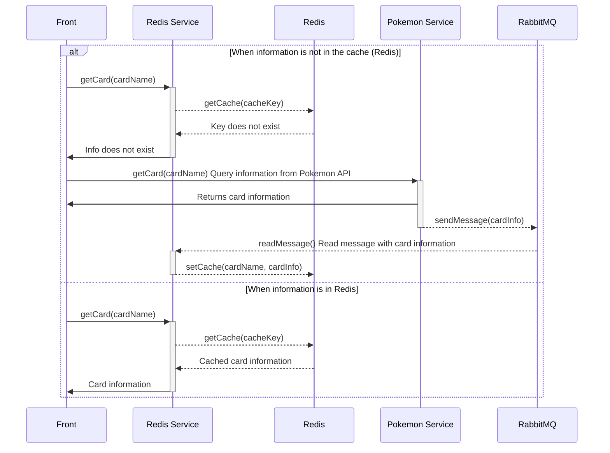

# Pokemon Card Info App

This React application displays information about Pokemon cards. It employs microservices to fetch data from an external Pokemon API and uses RabbitMQ for messaging between services. Data fetched for the first time is sent through RabbitMQ to the Redis service, which then caches it in Redis for faster subsequent access.

## Architecture

The system consists of three main components:

1. **React Microfrontend**: A user interface for searching and displaying Pokemon card information, based on a microfrontend architecture.
2. **Pokemon Microservice**: Queries the Pokemon API for card data. When data is fetched for the first time, it sends a message to the Redis service via RabbitMQ.
3. **Redis Microservice**: Manages caching of card data. It receives data from the Pokemon service through RabbitMQ and stores it in Redis cache.

## Sequence Diagram


The diagram represents a flow of interactions between different components of a system. There are four main participants: Front, Redis Service, Redis, and Pokemon Service. RabbitMQ (a messaging service) is also included.

The flow begins with the Frontend making a card query (getCard(cardName)) to the Redis Service. If the card information is not found in the Redis cache, a sequence of interactions occurs to fetch the information from the Pokemon API. The information is sent through RabbitMQ and stored in the Redis cache. If the card information is in the Redis cache, it is retrieved directly and returned to the Frontend.

## Requirements

- Node.js
- npm o yarn
- Docker

## Installation

First, clone the repository:

```bash
git clone https://github.com/elvisbrevi/ServiceMeshShowcase
```

## Build Vite Apps
# In microfrontend/card-component and microfrontend/card-app folders
```bash
npm run build
```

## Set up microservices and microfrontends with docker compose
## Create and run the images
```bash
docker-compose up --build
```
## Just run the images
```bash
docker-compose up
```

## Usage

Open your browser and go to http://localhost:5000/. Enter the name of a Pokemon card to search for its information. The application will first try to get the data from Redis and, if not available, will fetch it from the Pokemon API and store it in Redis for 30 seconds.

## Contributions

Contributions are welcome. Please fork the repository and submit a pull request with your improvements.

## Licence

This project is under the MIT license. See the LICENSE file for more details.
